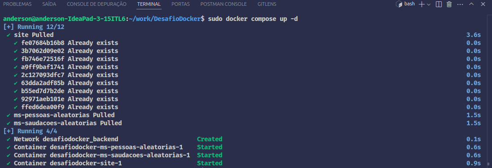
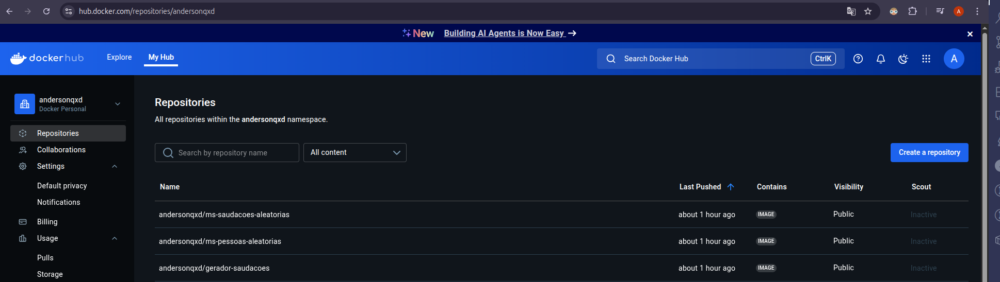
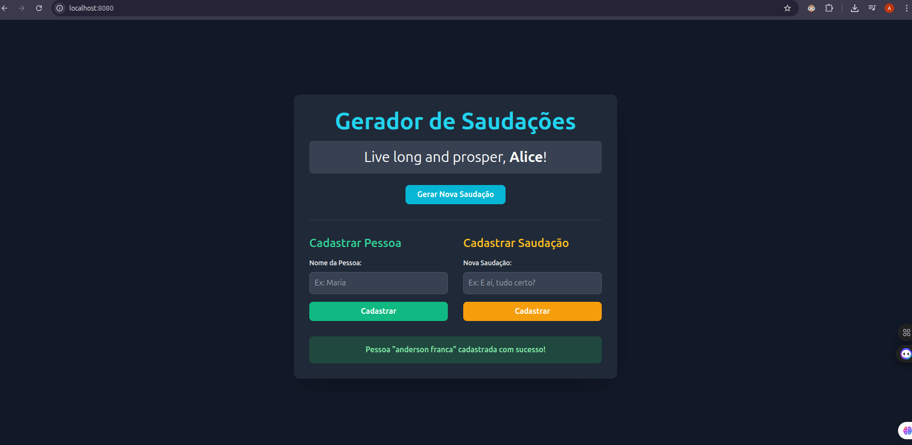

# 🚀 Desafio Docker - Bootcamp DevOps Atlântico Avanti

Este repositório contém uma aplicação composta por múltiplos microsserviços, cada um desenvolvido com diferentes linguagens e ferramentas, como parte do desafio proposto no curso de **DevOps do Bootcamp Atlântico Avanti**.

---

## 📁 Estrutura do Projeto

```bash
.
├── docker-compose.yaml          # Orquestração dos serviços com Docker Compose
├── limpa_docker.sh              # Script para limpeza de containers e imagens não utilizados
├── GeradorDeSaudacoes/          # Frontend HTML simples
├── PessoasAleatorias/           # Microsserviço em Go
└── SaldacoesAleatorias/         # Microsserviço em Python
```

---

## 🧪 Tecnologias Utilizadas

| Serviço                    | Linguagem/Ferramenta |
|---------------------------|----------------------|
| `PessoasAleatorias`       | Go                   |
| `SaldacoesAleatorias`     | Python               |
| `GeradorDeSaudacoes`      | HTML + Python (Flask ou similar) |
| Orquestração              | Docker Compose (YAML) |
| Automação de limpeza      | Shell Script         |

---

## 📸 Imagens do Projeto em Execução

### 🔧 Docker Compose rodando:


### 📂 Estrutura dos arquivos:


### 🌍 Aplicação web


---

## ▶️ Como Executar o Projeto

1. **Clonar o repositório:**
```bash
git clone https://github.com/seu-usuario/desafio-docker.git
cd desafio-docker
```

2. **Subir os serviços com Docker Compose:**
```bash
sudo docker compose up -d
```

3. **Acessar no navegador:**
```
http://localhost:8080
```

---

## 🧼 Limpeza do Ambiente

Caso deseje remover contêineres e imagens não utilizadas:

```bash
chmod +x limpa_docker.sh
./limpa_docker.sh
```

---

## 📚 Sobre o Projeto

Este projeto faz parte do **Desafio Docker** proposto no **Bootcamp de DevOps da Atlântico Avanti**, com foco em:
- Compreensão prática de containerização
- Integração de múltiplas tecnologias
- Orquestração via Docker Compose
- Automação de tarefas de limpeza com Shell Script

---

## 🧠 Aprendizados

- Criação de múltiplos containers interligados via rede Docker
- Uso de linguagens distintas com integração via HTTP
- Boas práticas em DevOps com versionamento, automação e isolamento de serviços

---

## 👨‍💻 Autor

Anderson - Estudante de TI | DevOps e Desenvolvimento  
🔗 [LinkedIn](https://www.linkedin.com/in/seu-perfil) | 🐙 [GitHub](https://github.com/seu-usuario)